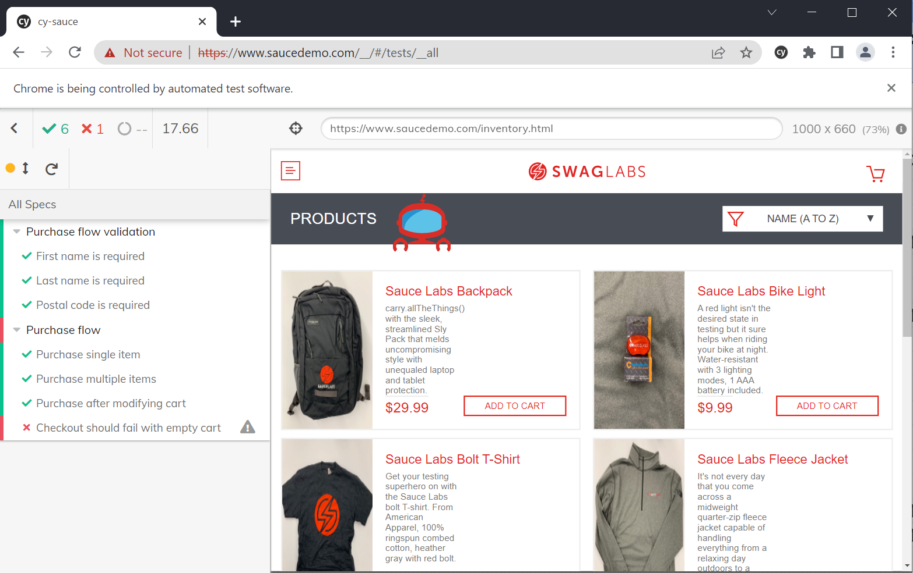

#  Saucedemo automation tests

## System requirements
- Node.js 14 or above (https://nodejs.org/en/download/)
- One of the following browsers installed
    - Chrome 64 and above
    - Edge 79 and above
    - Firefox 86 and above
    
## Installation
- `git clone https://github.com/sama-mammadova/sauce-automation.git`
- `cd sauce-automation`
- `npm install`

## Run tests
- `npx cypress open`
